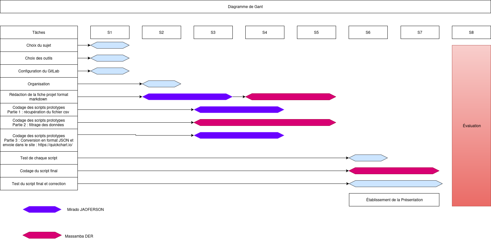

__SAE15 - Réussite au bacc__

## Objectif

L’objectif de ce projet est de mettre en place une chaîne automatisée de traitement de données permettant :

- de récupérer des données via un réseau,
- de les transformer vers un format cible après réalisation de calculs statistiques,
- puis de les transmettre à un serveur web pour affichage.

L’ensemble du processus doit être entièrement automatisé, sans intervention manuelle.

 ## <ins>Réussite au bacc </ins>

Pour avoir les données recherchées sur le taux de réussite au baccalauréat, nous réaliserons un « script » capable de récupérer les données nécessaires,au format CSV,sur le site https://www.data.gouv.fr/. Elles seront ensuite agrégées (calcul de moyennes, maximum, filtrage…), puis transformées au format JSON afin de les transmettre à un site web qui nous les affichera au format graphique. 

## Déroulement
Pour le déroulement de notre projet, nous procéderons aux étapes suivantes: 

 - Présentation du projet
 - Organistaion
    Après avoir présenter notre projet nous avons départager les taches.
    Tout d'abord nous avons choisi un chef de groupe qui est notre premier membre:__Andriamiradonambini JAOFERSON__
    dont il a initialiser le projet dans le gitlab afin d'ajouter les membres du groupe et l'enseignant réferent.
    Ensuite consernant le travail personnel :
    __La première partie du script__ a été confiée à notre chef de groupe.Elle a pour objectif de recuperer les données en format CSV sur le site web
    https://www.data.gouv.fr/ 
    __La deuxième partie du script__ a été confée à notre second membre, __Massamba DER__.Cette partie consiste à affectuer l'agrégégation 
    des données,c'est à dire le nettoyage, le filtrage, les calculs statistiques, ainsi que la conversion au format JSON.
    Enfin __la troisième partie__ à pour objectif  de transmettre les données à un site web afin de les afficher sous format graphique.
 - Codage du script prototype prise de données
 - Codage du Script prototype Transformation
 - Codage du script prototype Conversion __JSON__
 - Codage du Script Final

  

## Etapes du travail
Nous évaluerons le taux de réussite aux épreuves du baccalauréat en voie générale et technologique dans les académies de __Paris,de Lille, de LYON,de NANTES et de VERSAILLES__
 
Deux couleurs seront utilisées pour identifier les résultats:

 - VERT pour le taux de réussite
 - Rouge pour le taux de refus

Pour l'annalyse du taux de réussite aux baccalauréat, nous nous baserons sur :

- le nombre de participants
- le nombre de participants admis
- le nombre de participants refusés

__Script Première partie__

La première partie du script concerne le téléchargement du fichier csv en locale.

Le lien du fichier csv à étudié : "https://www.data.gouv.fr/fr/datasets/r/5e662e9b-f033-44fa-9e9a-a5b40fec2cd3"

Une fois que le script sera exécuté, __un répertoire__ sera créé contenant le fichier.

__Script Deuxième partie__

La deuxième partie conserne le Néttoyage des données filtrage et calcule statistiques.

Le scripte permet de générer un Histogramme groupé  comparant cinq académies majeurs, afin de 
 visualiser simultanément les éffectifs:
 des présents,
 des admis,
 des refusés

__Script Troisième partie JSON__

La derniére partie regroupe l'ensemble des étapes précedentes.
 
Il a pour objectif de charger et d'exporter toutes les données puis transformées au format JSON 
afin de les transmettre à un site web qui nous les affichera sous format graphique.

